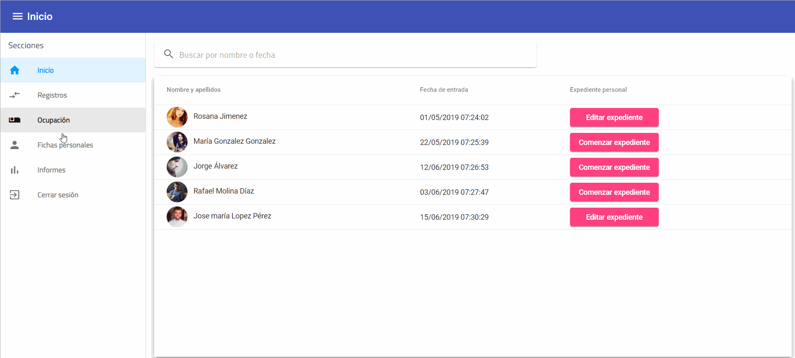

# :exclamation: Aplicación web para la casa de acogida de Córdoba :exclamation:

## Por Jose Rafaél Álvarez Espino y Marcos Gallardo Pérez

Surge de la necesidad de gestionar mediante una aplicación web el trabajo que se lleva a cabo en la casa de acogida Campo madre de Dios de Córdoba.

------------

------------

 ### Funcionalidades:

------------
**Registro de la persona**: Trabajo asignado a los conserjes, permite buscar a la persona en registro, si no se encuentra, esta se podría meter en el sistema y añadir el registro de dicha persona.

**Cambio de cama, y asignación fecha salida**: A una persona detro de la casa de acogida, se le debe permitir cambiar de cama, y asignar una fecha de salida. Siendo necesario un registro de las entradas/salidas de dicha persona además de las camas que ha ocupado y durante cuanto tiempo.

**Vista Técnico**: La tarea del técnico es hacer un expediente técnico de la persona que visita la casa de acogida. Pudiendo ver los datos de todos los expedientes que se le han hecho a dicha persona. 

**Haciendolos**:

**Viendo los resultados**:

**Informes**: En todo momento se pueden visitar distintos informes de la aplicación que te muestran distintas comparativas de algunos datos.

